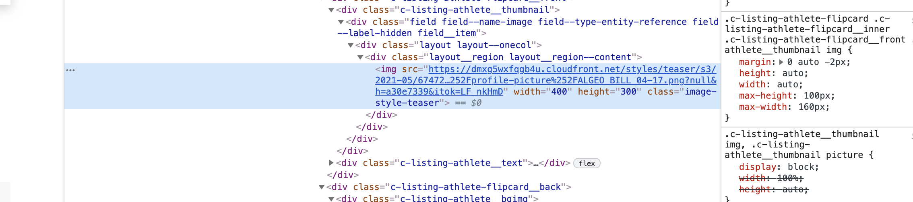
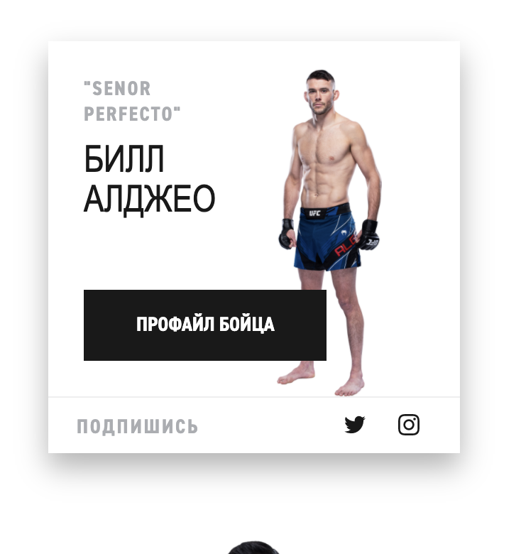

1. Нужно зайти на страницу: https://ru.ufc.com/athletes/all

2. Выбрать в фильтре нужный вес
3. **(В Google Chrome)** Нажать правой кнопкой на страницу и выбрать `Посмотреть код`

4. Откроется окно и там нужно выбрать квадрат со стрелкой. Это позволит быстрее отыскать элемент на странице

5. Далее наводим на бойца и нажимаем

**PS: Вместо предыдущих манипуляций можно нажать `Ctrl + Shift + C`**

**И у Вас сразу выберется квадрат со стрелкой и не нужно нажимать правую кнопку и тд. **Это еще пригодится далее.****

6. Послетого, как нажали на бойца у Вас откроется такая панель

7. Внутри блока `src` ссылка на эту картинку. Копируем ссылку, вставляем в новое окно и сохраняем в папке
`[ВЕС БОЙЦА]/[ИМЯ]`

На этой странице у бойцов есть еще другая картинка, она появляется если навести мышкой на карточку

Так вот, наводим на карточку и нажимаем `Ctrl+Shift+C`
Затем выбираем картинку и нажимаем. Повторяем процесс, как с предыдущей картинкой

Профиль
=====
Заходим в профиль (На карточке бойца есть ссылка)
И повторяем предыдущие манипуляции

С этой картинкой

И с этой
